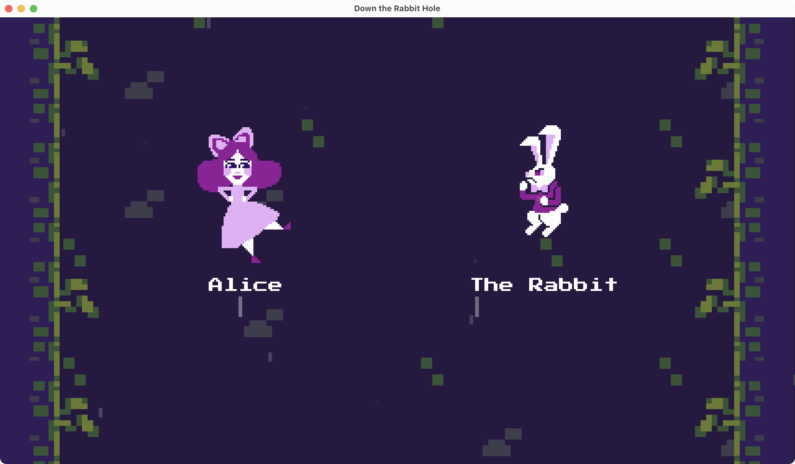

An entry to [Ludum Dare 48](https://ldjam.com/events/ludum-dare/48)

# Binaries

Check [Releases](https://github.com/tonsky/down-the-rabbit-hole/releases/).

# Running from source

You’ll need Python 3, Clojure and JVM installed:

```
brew install clojure
./script/run.py
```

# Progress

Not much—only “End turn” button works.

# Stack

- LWJGL
- Clojure
- [DataScript](https://github.com/tonsky/datascript) 1.1.0
- [Skija](https://github.com/jetbrains/skija) 0.90.16

# Screenshot

